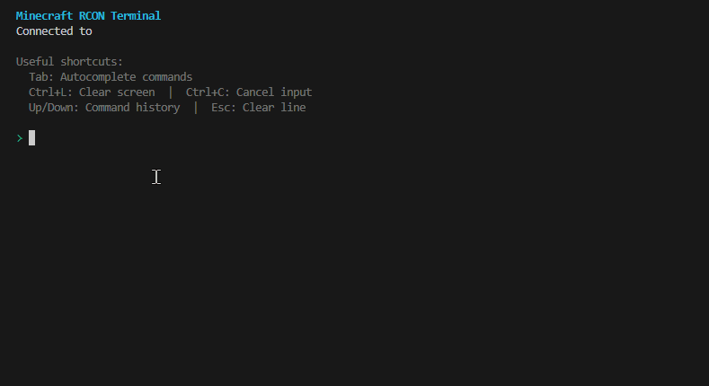

# Minecraft RCON Terminal for VS Code

A powerful VS Code extension that provides a fully-featured terminal interface for managing Minecraft servers via RCON (Remote Console) protocol. Features intelligent command autocomplete, Minecraft formatting support, and a rich terminal experience.



## ✨ Features

### 🎮 Smart Command Autocomplete
- **Intelligent suggestions** - Real-time command completion as you type
- **Tab completion** - Minecraft-style tab cycling through suggestions
- **Argument hints** - Context-aware help showing required and optional arguments
- **Search support** - Deep navigation through command trees
- **Command caching** - Fast autocomplete after initial load

### 🖥️ Rich Terminal Experience
- **Minecraft color codes** - Full support for all Minecraft formatting codes (§0-§f, §d, §c, etc.)
- **Command history** - Navigate through previous commands with Up/Down arrows
- **Text selection** - Select, copy, cut, and paste with standard keyboard shortcuts
- **Multi-line output** - Properly formatted server responses
- **Connection status** - Visual indicators for connection state

### 🔄 Robust Connection Management
- **Auto-reconnection** - Automatic reconnection with exponential backoff
- **Manual reconnect** - `/reconnect` command for manual connection control
- **Connection persistence** - Maintains connection across VS Code restarts
- **Error recovery** - Graceful handling of network issues

### ⌨️ Keyboard Shortcuts
| Shortcut | Action |
|----------|--------|
| `Tab` | Autocomplete/cycle suggestions |
| `Shift+Tab` | Reverse cycle suggestions |
| `↑/↓` | Navigate command history or suggestions |
| `Home/End` | Jump to first/last suggestion |
| `Page Up/Down` | Navigate suggestion pages |
| `Ctrl+L` | Clear screen |
| `Ctrl+C` | Copy selection or cancel input |
| `Ctrl+V` | Paste |
| `Ctrl+A` | Select all |
| `Ctrl+←/→` | Jump word left/right |
| `Ctrl+W` | Delete word backward |
| `Ctrl+U` | Clear line |
| `Ctrl+D` | Disconnect |
| `Esc` | Cancel autocomplete or clear line |

## 📦 Installation

### From VS Code Marketplace
1. Open VS Code
2. Press `Ctrl+Shift+X` to open Extensions
3. Search for "Minecraft RCON Terminal"
4. Click Install

### From VSIX Package
1. Download the `.vsix` file from [Releases](https://github.com/jaketcooper/Minecraft-rcon/releases)
2. Open VS Code
3. Press `Ctrl+Shift+P` and run "Extensions: Install from VSIX..."
4. Select the downloaded `.vsix` file

## 🚀 Getting Started

### Quick Connect
1. Press `Ctrl+Shift+P` to open Command Palette
2. Type "Minecraft RCON" and select "Connect to Minecraft RCON"
3. Enter connection details:
   - **Host**: Your server IP (default: `localhost`)
   - **Port**: RCON port (default: `25575`)
   - **Password**: Your RCON password

### Enable RCON on Your Server
Add these lines to your `server.properties`:
```properties
enable-rcon=true
rcon.port=25575
rcon.password=your-secure-password
```

## 📋 Built-in Commands

| Command | Description |
|---------|-------------|
| `/help` | Show built-in commands help |
| `/clear` | Clear terminal screen |
| `/reconnect` | Manually reconnect to server |
| `/disconnect` | Disconnect from server |
| `/reload-commands` | Reload command database |

## ⚙️ Configuration

### Extension Settings
Configure in VS Code settings (`Ctrl+,`):

```json
{
  // Default connection settings
  "minecraftRcon.defaultHost": "localhost",
  "minecraftRcon.defaultPort": 25575,
  
  // Terminal behavior
  "minecraftRcon.autoReconnect": true,
  "minecraftRcon.reconnectDelay": 2000,
  "minecraftRcon.maxReconnectAttempts": 5,
  
  // Display settings
  "minecraftRcon.maxSuggestionsVisible": 10,
  "minecraftRcon.historyLimit": 100,
  
  // Command loading
  "minecraftRcon.autoLoadCommands": true,
  "minecraftRcon.commandCacheTimeout": 3600000
}
```

### Saved Connections
Save frequently used servers for quick access:

1. Press `Ctrl+Shift+P`
2. Run "Minecraft RCON: Manage Saved Connections"
3. Add, edit, or remove saved servers

## 🎯 Usage Examples

### Basic Commands
```minecraft
/gamemode creative Steve
/give @a diamond 64
/tp @p ~ ~10 ~
/weather clear 1000
```

### Using Autocomplete
1. Type `/` to see all available commands
2. Start typing a command name to filter suggestions
3. Press `Tab` to complete the selected suggestion
4. Continue typing for argument hints

### Command Arguments
When typing commands, you'll see helpful hints:
- `<required>` - Required arguments
- `[optional]` - Optional arguments
- `@selectors` - Target selectors (@p, @a, @r, @e, @s)

## 🔧 Troubleshooting

### Connection Issues
- **"Connection refused"** - Check if RCON is enabled in server.properties
- **"Authentication failed"** - Verify your RCON password
- **"Timeout"** - Check firewall settings and ensure port is open

### Autocomplete Not Working
1. Check the output panel for errors (`View → Output → Minecraft RCON`)
2. Try `/reload-commands` to refresh the command database
3. Ensure you have permission to run `/help` on the server

### Color Codes Not Displaying
- Ensure your terminal supports ANSI color codes
- Check VS Code terminal color settings

## 🤝 Contributing

Contributions are welcome! Please feel free to submit pull requests or create issues for bugs and feature requests.

### Development Setup
```bash
# Clone the repository
git clone https://github.com/yourusername/minecraft-rcon.git

# Install dependencies
npm install

# Compile and watch
npm run watch

# Run tests
npm test
```

### Building from Source
```bash
# Build the extension
npm run compile

# Package as VSIX
npm run package
```

## 📄 License

This project is licensed under the MIT License - see the [LICENSE](LICENSE) file for details.

## 🙏 Acknowledgments

- Built with the [rcon-client](https://github.com/janispritzkau/rcon-client/) library
- Inspired by the Minecraft community's need for better server management tools
- Thanks to all contributors and testers

## 📊 Version History

### v1.0.0 (Latest)
- Initial release
- Full command autocomplete system
- Minecraft color code support
- Connection management
- Command history
- Keyboard shortcuts

## 💬 Support

- **Issues**: [GitHub Issues](https://github.com/jaketcooper/Minecraft-rcon/issues)
- **Discussions**: [GitHub Discussions](https://github.com/jaketcooper/Minecraft-rcon/discussions)
- **Discord**: [Join our Discord](https://discord.gg/un1t)

---

Made with ❤️ for the Minecraft community